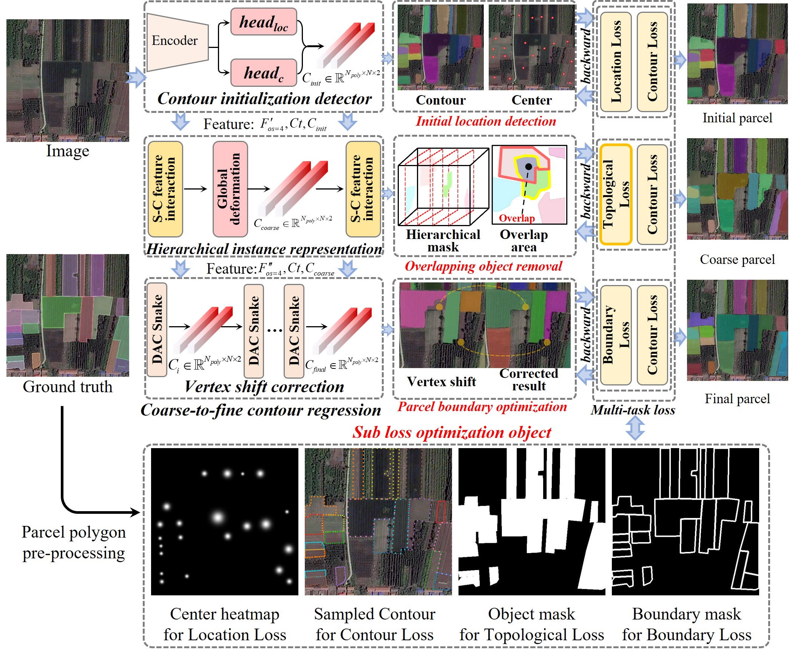

<h2 align="center">E2EVAP: End-to-end vectorization of smallholder agricultural parcel boundaries from high-resolution remote sensing imagery</h2>
<h5 align="right">by <a>Yang Pan</a>,<a>Xingyu Wang</a>,<a href="http://rsidea.whu.edu.cn/">Yanfei Zhong</a>, and  Liangpei Zhang</h5>


This is an official implementation of E2EVAP in our ISPRS 2023 paper <a href="https://www.sciencedirect.com/science/article/pii/S0924271623002162">E2EVAP: End-to-end vectorization of smallholder agricultural parcel boundaries from high-resolution remote sensing imagery</a>


---------------------
## Citation
If you use E2EVAP in your research, please cite the following paper:
```
@article{PAN2023246,
title = {E2EVAP: End-to-end vectorization of smallholder agricultural parcel boundaries from high-resolution remote sensing imagery},
journal = {ISPRS Journal of Photogrammetry and Remote Sensing},
volume = {203},
pages = {246-264},
year = {2023},
issn = {0924-2716},
doi = {https://doi.org/10.1016/j.isprsjprs.2023.08.001},
url = {https://www.sciencedirect.com/science/article/pii/S0924271623002162},
author = {Yang Pan and Xinyu Wang and Liangpei Zhang and Yanfei Zhong},
}
```
## Getting Started
The E2EVAP is being prepared for publication, and we will make source code available for reproducibiliy and benchmarking purposes here as soon as possible.
